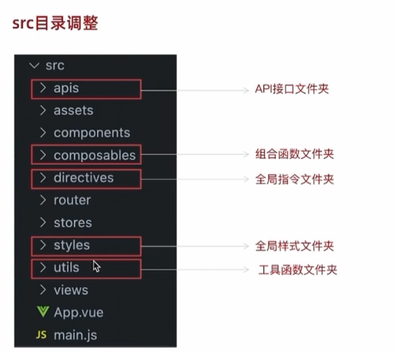

# 比赛
## 技术栈
1. 前端:vue3 + ts + pinia + vite
2. 后端:node +mongodb / springboot + mysql
## 初始化项目
### git管理
git init

git add .

git commit -m ''

根据GitHub来做就可以了
### 目录结构

### 别名的设置
```
//    别名的配置
"baseUrl": "./",
    "paths": {
    "@": ["src"],
        "@/*": ["src/*"]
}
```
```
//vite.config.ts
resolve:{
    alias:{
        "@":path.resolve(__dirname,"src")
    }
}
```
### vite.config.ts配置
```ecmascript 6
export default defineConfig({
    plugins: [vue()],
    resolve:{
        alias:{
            "@":path.resolve(__dirname,"src")
        }
    },
    server:{
        port:8080,
        //热更新
        hmr:{
            host:'127.0.0.1',
            port:8080
        },
        //设置https代理(写接口的时候写)

    }
})
```
### 代码风格统一（eslint+prettier）
#### .eslintrc.js/.eslintrc.json+.eslintignore
1. 安装  npm install -D eslint eslint-plugin-vue
2. 按照[https://eslint.vuejs.org/user-guide/#usage](https://eslint.vuejs.org/user-guide/#usage)配即可
3. 在命令行输入
   "eslint": "eslint . --ext .vue,.js,.jsx,.cjs,.mjs --fix --ignore-path .gitignore",
4. 因为eslint使用的是espree语法解析，所以要安装
`` @typescript-eslint/parser,`` 
```
npm i @typescript-eslint/parser -D
```
5. 一些ts额外的eslint的语法规则
```
npm i @typescropt-eslint/eslint-plugin --save-dev
```
在.eslintrc.js/.eslintrc.json中配置
```ecmascript 6
module.exports = {
    root: true,
    extends: [
        'plugin:vue/vue3-essential',
        'eslint:recommended',
        'prettier',
        'plugin:prettier/recommended',
        'plugin:@/typescript-eslint/recommended',
    ],
    parserOptions: {
        ecmaVersion: 'latest',
    },
}
```
6. .eslintignore
```
# (不需要检查的)
node_modules/
dist/
index.html
```
#### 代码规范prettier
1. 下载
```
npm i prettier eslint-config-prettier eslint-plugin-prettier -D
```
2. 配置文件 prettier.config.js或.prettierrc.js可以定义规则
```
{
    "printWidth": 80,
    "tabWidth":4,
    "semi": false,
    "singleQuote": true,
    "endOfLine": "auto",
    "trailingComma": "all"
}
```
3. 在eslint中配置
```ecmascript 6
module.exports = {
    root: true,
    extends: [
        'plugin:vue/vue3-essential',
        'eslint:recommended',
        'prettier',
        'plugin:prettier/recommended',
        'plugin:@/typescript-eslint/recommended',
    ],
    parserOptions: {
        ecmaVersion: 'latest',
    },
}

```
4. 最后使用webstorm中的自动配置prettier来规范代码，就可以不用在package.json里面写了
### Pinia
在src/store里面创建index.ts
```ecmascript 6
import {createPinia} from "pinia";
const pinia = createPinia()
export default pinia
```
```ecmascript 6
main.ts使用
import { createApp } from 'vue'
import './style.css'
//导入pinia
import pinia from "@/store";
import App from './App.vue'
const app = createApp(App)
app.use(pinia)
app.mount('#app')

```
之后的使用我再明确地说，现在只是基本配置
### vue-router
在src/router下创建index.ts,并导出router
```
import {createRouter, createWebHistory, RouteRecordRaw} from "vue-router";

const routes :Array<RouteRecordRaw> = [
    
]
const router = createRouter({
    history:createWebHistory(),
    routes
})
export default router
```
在main.ts中使用
```ecmascript 6
import { createApp } from 'vue'
import './style.css'
//导入pinia
import pinia from '@/store'
//导入router
import router from "@/router";
import App from './App.vue'
const app = createApp(App)
app.use(pinia)
app.use(router)
app.mount('#app')

```
### 配置axios
安装
```
npm i axios
```
在src/utils下创建http.ts
配置axios和请求拦截器，相应拦截器
```typescript
import axios, {AxiosInstance, AxiosResponse, InternalAxiosRequestConfig} from 'axios'

const http: AxiosInstance = axios.create({
    baseURL: 'http://www.disastar.edu.cn',
    timeout: 5000,
})

//请求拦截器
http.interceptors.request.use(
    function (config:InternalAxiosRequestConfig):InternalAxiosRequestConfig {
        return config
    },
    function (error:any) {
         return Promise.reject(error)
    },
)

//相应拦截器
http.interceptors.response.use(function (response:AxiosResponse):AxiosResponse{
    return response
},function (error:any){
    return Promise.reject(error)
})
export default http


```
页面哪里有请求哪里就导入就可以了
### 样式
#### UI库本项目采用地是Ant Design Vue3
1. 安装
```
npm install ant-design-vue --save
```
2. 按需加载
先安装这个包
```
npm i unplugin-vue-components -D
```
在vite中引入ant design vue3项目，没有使用vue4的因为之前用发现样式丢失了
```typescript
import { defineConfig } from 'vite'
import vue from '@vitejs/plugin-vue'
import * as path from 'path'
//自动引入ant design vue3
import Components from 'unplugin-vue-components/dist/vite'
import { AntDesignVueResolver } from 'unplugin-vue-components/dist/resolvers'

// https://vitejs.dev/config/
export default defineConfig({
    plugins: [
        vue(),
        //自动引入ant design vue3
        Components({
            resolvers: [AntDesignVueResolver()],
        }),
    ],
    resolve: {
        alias: {
            '@': path.resolve(__dirname, 'src'),
        },
    },
    server: {
        port: 8080,
        //热更新
        hmr: {
            host: '127.0.0.1',
            port: 8080,
        },
        //设置https代理(写接口的时候写)
    },
})
```


